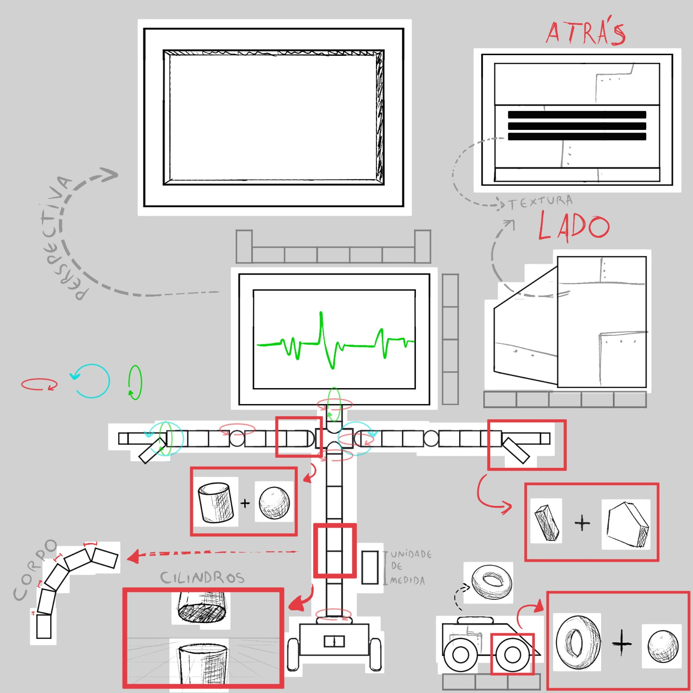
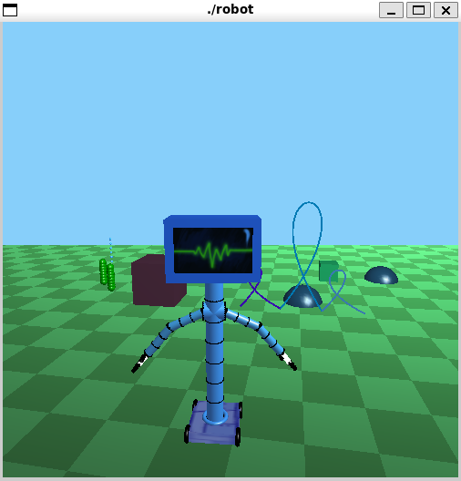
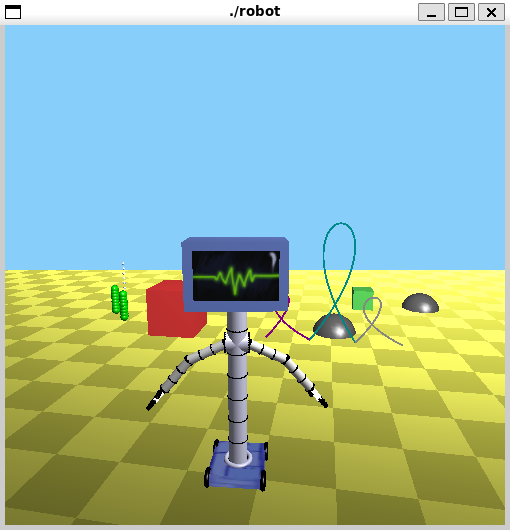
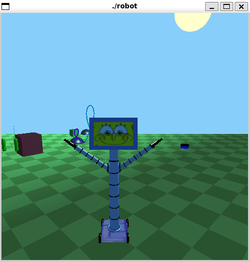
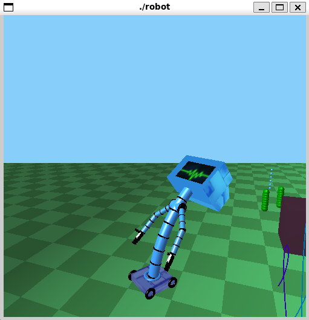
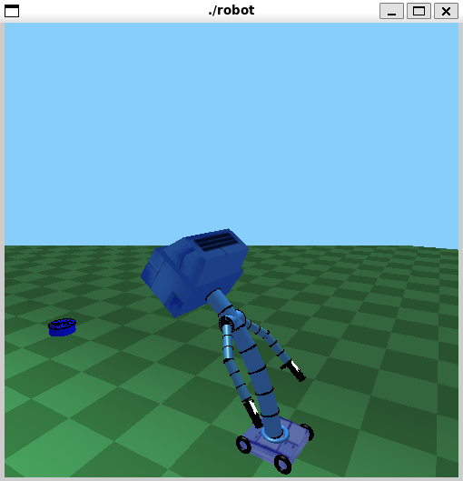

# 🤖 Projeto de Computação Gráfica - Robô Karen 

Repositório do projeto desenvolvido para a disciplina **Introdução à Computação Gráfica** do curso de **Engenharia de Computação - UFPB**.  
O projeto consiste na implementação, em **linguagem C com OpenGL**, de um robô humanoide inspirado na **Karen** (computador do Plankton, do desenho *Bob Esponja*).  

O robô possui movimentos corporais e consegue se deslocar utilizando rodas em seus "pés".  


## 📌 O que o código faz
- Renderiza em 3D a personagem Karen como um robô humanoide.  
- Permite movimentação dos braços.
- Permite movimentação de câmera.
- Permite troca de rostos para o robô.
- Permite troca de iluminação.
- Possui rodas para locomoção.  
- Movimentos básicos de deslocamento e movimentos coordenados.

## 🎮 Controles  

O robô Karen e a cena podem ser controlados via teclado. Abaixo estão todas as teclas e suas funções:

### 🔹 Movimento do Robô  
- **W / w** : Mover para frente  
- **S / s** : Mover para trás  
- **A / a** : Girar para a esquerda em torno do seu eixo 
- **D / d** : Girar para a direita em torno de seu eixo

### 🔹 Câmera (Órbita ao redor da cena)  
- **I / i** : Orbitar para a esquerda  
- **O / o** : Orbitar para a direita
- **P / p** : Movimentação de câmera com curva de Bezier

### 🔹 Braços e Articulações  
- **Z / z** : Abaixar o braço (ombro)  
- **H / h** : Levantar o braço (ombro)
- **Y / y** : Trazer o braço pra frente
- **N / n** : Levar o braço para trás
- **X / x** : Dobrar o cotovelo  
- **J / j** : Esticar o cotovelo
- **b** : Girar base no sentido anti-horário  
- **B** : Girar base no sentido horário
- **e** : Girar o robô no sentido anti-horário  
- **E** : Girar o robô no sentido horário  

### 🔹 Inclinação do Corpo  
- **K / k** : Inclinar o corpo para frente
- **L / l** : Inclinar o corpo para trás  

### 🔹 Aparência e Cena  
- **T / t** : Trocar o rosto da Karen  
- **Q / q** : Alternar iluminação do cenário (entre configurações diferentes)  

### 🔹 Outros  
- **ESC** : Sair do programa  


## 🎨 Desenho esquemático do robô
Um esquema em desenho das partes que compõem o robô:  

  


## 🖼️ Imagens do programa
Imagens do programa em execução:  



  

  

  

  


## ⚙️ Como compilar e executar

### Dependências
- Compilador **GCC** (ou compatível).  
- **OpenGL** e **GLUT** instalados na máquina.  

No Linux (Ubuntu/Debian), instale com:
```bash
sudo apt-get update
sudo apt-get install freeglut3-dev
```
No Windows, recomenda-se usar o MinGW ou outro compilador C com suporte a OpenGL e GLUT.

### Compilação
No Linux:
```bash
g++ geometry.cpp robot.cpp -o robot -lGL -lGLU -lglut
```
No Windows (exemplo com MinGW):
```bash
g++ geometry.cpp robot.cpp -o robot -lopengl32 -lglu32 -lfreeglut
```

### Execução
```bash
./robot
```


## ⚠️ Principais problemas encontrados
- Problema 1: Linkar os elementos do robô uma vez criados de maneiras separadas. No nosso caso, a criação da cabeça do robô foi uma das primeiras partes a ser criada e depois o corpo junto com a base. Eles desevem se mover todos juntos e isso acabou sendo um problema na hora da implementação. - [Jasom Rocha](https://github.com/JasomRocha)
- Problema 2: Dificuldades de implementação, na lógica de espelhamento dos braços, e colocar as "garras" do robô. - [Jasom Rocha](https://github.com/JasomRocha)
- Problema 3: Dificuldades de implementação de mais objetos na cena, mesmo sendo objetos mais básicos. - [Igor Matheus](https://github.com/Igor-Matheus)


## 🚀 O que pode ser melhorado
- Melhoria 1: Maneira como os braços foram implemnetados e a lógica de movimentação pelo cenário (questões físicas e referenciais) - [Jasom Rocha](https://github.com/JasomRocha)
- Melhoria 2: Texturas mais realistas para serem colocadas no ambiente da cena, bem como acréscimo de mais elementos. - [Igor Matheus](https://github.com/Igor-Matheus)
- Melhoria 3: Adição de elementos mais complexos no cenário como estruturas que aparecem no desenho animado e etc. [Gustavo Gomes](https://github.com/IGustaMe)


## 👨‍💻 Autoria
Projeto desenvolvido por:
- [Gustavo Gomes](https://github.com/IGustaMe) - Desenhos esquemáticos e de textura. Modelagem da cabeça do robô a partir de polígonos utilizando a função glBegin(GL_QUADS) para cada parte da TV. Ajuste no zBuffer de profundidade, antes indisponível no código base. Aplicação das texturas em cada polígono. Inclinação conjunta dos cilindros que compõem o corpo e articulações extras para o braço e a base.
- [Igor Matheus](https://github.com/Igor-Matheus) - Toda a estrutura do README.md, bem como a maior parte das coisas escritas e adicionadas nele. Implementação de mais objetos na cena (bolhas, algas, pedras). Adição de iluminação mais parecida com o fundo do mar e botão (tecla Q/q do teclado) para alternar entre a iluminação anterior e a que simula o fundo do mar. Implementaçao da alteração das texturas no rosto do robô Karen, alterações essas que ocorrem ao apertar a tecla T/t do teclado.  
- [Jasom Rocha](https://github.com/JasomRocha) - Desenvolvi o corpo do robô juntamente com a primeira ideia de cenário, basicamente defini como se constrói um cilindro para visualização 3D e depois empilhei um total de 7 cilindros logo abaixo da cabeça (TV) do robô. Criei alguns inputs de movimentação do robô e fiz com que ele se desloque pelo cenário, de maneira que podemos observar sua movimentação olhando para os objetos que foram postos para compor a cena, isso é o inicio da abordagem final, e foi tudo que foi trabalhado por mim na primeira semana de desenvolvimento do projeto fazendo o commit das alterações em (27/09). 
  Em (29/09) fiz o commit dos braços e da movimentação dos braços do robô, tive dificuldades de implementação, na lógica de espelhamento dos braços e colocar as "garras" do robô.
  EM (01/10) fiz commit da movimentação da camera com curva de bezier, alterações visuais no cenário no chão e inseri a curva de bezier de uma das atividades práticas. 

### ---> Evidência 1 (27/09) - [Jasom Rocha](https://github.com/JasomRocha)


### ---> Evidência 2 (27/09) - [Jasom Rocha](https://github.com/JasomRocha)


### ---> Evidênica 3 (29/09) - [Jasom Rocha](https://github.com/JasomRocha)


### ---> Evidênica 4 (01/10) - [Jasom Rocha](https://github.com/JasomRocha)


